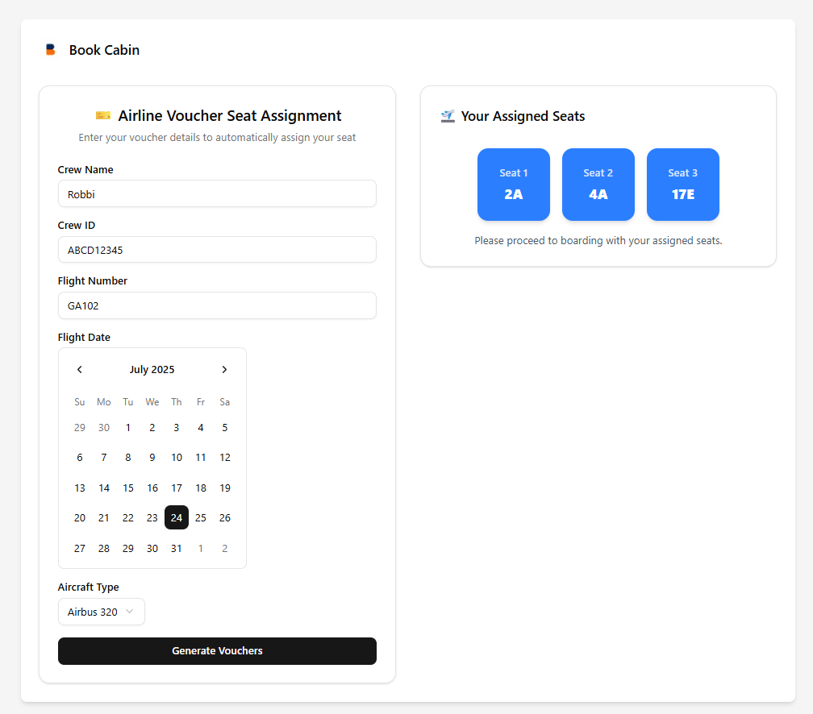
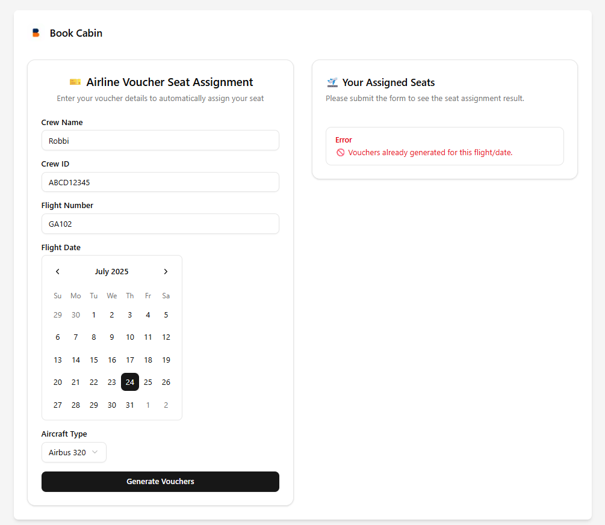
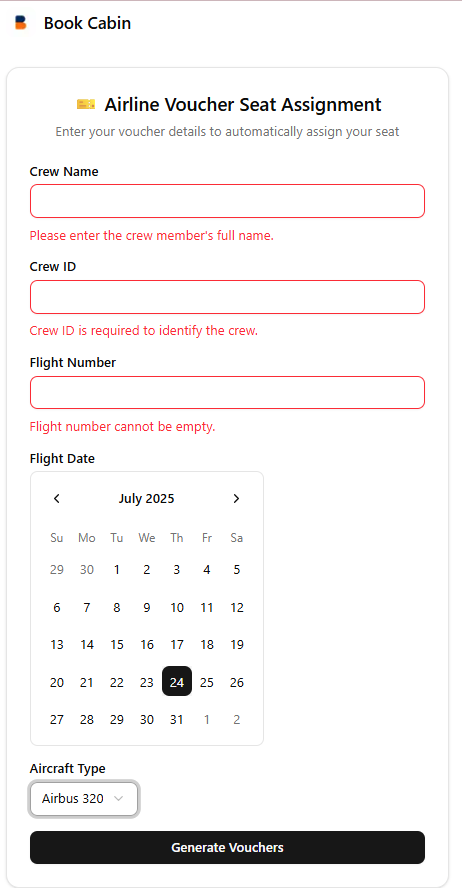

# ✈️ Airline Voucher Seat Assignment

This project is a full-stack application that allows users to submit a voucher and get seat assignment results. It includes:

- 🖥️ Frontend: Built with Next.js, TailwindCSS, shadcn/ui
- 🖧 Backend: Built with Go, Fiber, SQLite, and clean DDD architecture
- 🐳 Docker Compose setup to run both backend and frontend together

---

## 📦 Prerequisites

- Docker & Docker Compose installed
- (Optional) Go (1.24+) and Node Js (v22.11.0) if you want to run backend and frontend without docker

---

## 🚀 Getting Started

### 1. Clone the Repository

    git clone https://github.com/your-username/airline-voucher.git
    cd airline-voucher

### 2. Run with Docker Compose (Recommended)
This command will build and run both the frontend and backend with docker:

    ```bash
    make up
    ```

If you don’t have make installed, you can run:

    ```
    docker-compose up --build -d
    ```

### 3. Run Without Docker (Optional)

If you prefer to run the frontend and backend without Docker:

    ```bash

    make run-backend
    
    ```
Open a new terminal tab/window:
     
    ```bash
    make run-frontend
    ```

---
## 🌐 Services

The services will be available at:

Frontend: http://localhost:3000

Backend API: http://localhost:8080

Swagger API Docs: http://localhost:8080/swagger/index.html

---
## ✅ Example Screenshots
Success Response



Error Response



Form Validation

